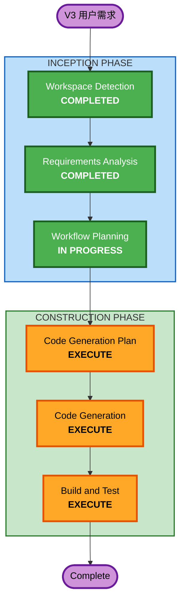

# V3 执行计划 - 多玩家可见性

## 详细分析摘要

### 变更范围
- **变更类型**: 多组件功能扩展（非架构变更）
- **主要变更**: Game Server 广播机制 + Frontend 远程玩家渲染
- **涉及组件**: Game Server (index.js), Frontend (Player.js, WebSocketClient.js, main.js)

### 变更影响评估
- **用户可见**: 是 - 地图上出现其他玩家角色
- **架构变更**: 否 - 在现有 WebSocket 架构上扩展
- **数据模型变更**: 否 - 不需要新 DynamoDB 表
- **API 变更**: 是 - 新增 4 种 WebSocket 消息类型
- **NFR 影响**: 否 - 广播机制轻量，不影响现有性能

### 组件关系
- **主要组件**: Game Server (WebSocket广播), Frontend (远程玩家渲染)
- **不涉及**: NPC Agent, Infrastructure, DynamoDB, AgentCore
- **依赖方向**: Frontend ← WebSocket ← Game Server

### 风险评估
- **风险等级**: 低
- **回滚复杂度**: 简单（独立功能，不影响现有逻辑）
- **测试复杂度**: 简单（打开两个浏览器窗口即可验证）

## 工作流可视化

## 阶段执行计划

### INCEPTION PHASE
- [x] Workspace Detection - COMPLETED
- [x] Requirements Analysis - COMPLETED
- [x] Workflow Planning - IN PROGRESS
- [x] Reverse Engineering - SKIP（已有架构文档）
- [x] User Stories - SKIP（纯展示功能，无复杂用户场景）
- [x] Application Design - SKIP（无新组件，在现有组件上扩展）
- [x] Units Generation - SKIP（单一工作单元，无需分解）

### CONSTRUCTION PHASE
- [ ] Functional Design - SKIP（无新数据模型或复杂业务逻辑）
- [ ] NFR Requirements - SKIP（无新性能/安全需求）
- [ ] NFR Design - SKIP（无 NFR 需求）
- [ ] Infrastructure Design - SKIP（无基础设施变更）
- [ ] Code Generation - EXECUTE（核心实现）
- [ ] Build and Test - EXECUTE（部署验证）

### OPERATIONS PHASE
- [ ] Operations - PLACEHOLDER

## 组件更新顺序
1. **Game Server** (index.js) - 添加连接注册表 + 广播机制 + 新消息处理
2. **Frontend** (RemotePlayer + WebSocketClient + GameScene) - 添加远程玩家渲染

## 成功标准
- **主要目标**: 多个浏览器窗口登录不同玩家，能互相看到对方角色
- **关键交付**: WebSocket广播机制、RemotePlayer 渲染、位置实时同步
- **验证方式**: 打开两个浏览器窗口，分别登录不同玩家，验证互相可见
