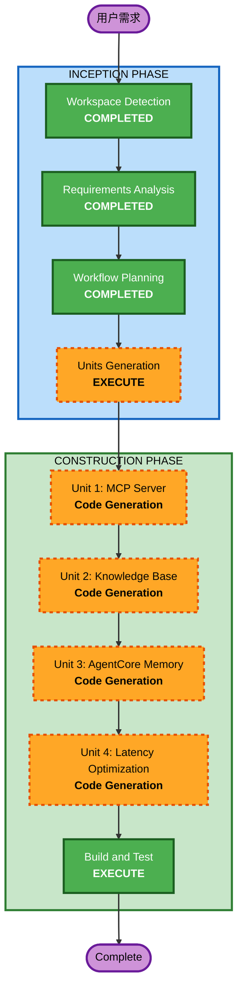

# 执行计划

## 详细分析概述

### 变更范围（Brownfield）
- **变更类型**: 架构级变更（NPC Agent 从预获取+单次调用 改为 MCP Server + Memory + KB 架构）
- **主要变更**: NPC Agent 核心架构重构，涉及 4 项功能增强
- **相关组件**: NPC Agent（Python）、Game Server（Node.js）、基础设施（CloudFormation）、前端（WebSocket 协议兼容）

### 变更影响评估
- **用户可感知变化**: 是 - NPC 对话响应变为流式输出，延迟显著降低
- **结构性变化**: 是 - NPC Agent 从单次 LLM 调用改为 MCP Tool Use 模式
- **数据模型变化**: 否 - DynamoDB 表结构不变，新增 KB 和 Memory 存储
- **API 变化**: 否 - Game Server 对前端的 WebSocket 协议保持不变
- **NFR 影响**: 是 - 性能优化（延迟从 3s 降至 <1s 感知延迟）

### 组件关系
```
Frontend (无变更) --> Game Server (小幅改动: streaming 支持)
                          |
                          v
                    AgentCore Runtime
                          |
                          v
                  NPC Agent (重大重构)
                   /     |      \
                  v      v       v
              MCP Tools  Memory  KB
              (FR-2)    (FR-1)  (FR-3)
                  \      |      /
                   v     v     v
              Bedrock Converse API
              (FR-4: streaming + caching)
```

### 风险评估
- **风险等级**: 中等
- **回滚复杂度**: 中等（可逐个功能回滚）
- **测试复杂度**: 中等（需验证 MCP 工具调用、Memory 持久化、KB 查询准确性）

---

## 工作流可视化



Text Alternative:
```
INCEPTION PHASE:
  - Workspace Detection (COMPLETED)
  - Requirements Analysis (COMPLETED)
  - Workflow Planning (COMPLETED)
  - Units Generation (EXECUTE)

CONSTRUCTION PHASE (Per-Unit Loop):
  - Unit 1: MCP Server Architecture - Code Generation (EXECUTE)
  - Unit 2: Knowledge Base Integration - Code Generation (EXECUTE)
  - Unit 3: AgentCore Memory Integration - Code Generation (EXECUTE)
  - Unit 4: Latency Optimization - Code Generation (EXECUTE)
  - Build and Test (EXECUTE)
```

---

## 阶段执行决策

### INCEPTION PHASE
- [x] Workspace Detection (COMPLETED)
- [x] Requirements Analysis (COMPLETED)
- [ ] User Stories - **SKIP**
  - **理由**: 需求明确为技术架构增强，无新用户角色或交互流程变化
- [x] Workflow Planning (IN PROGRESS)
- [ ] Application Design - **SKIP**
  - **理由**: 需求文档已详细定义了组件架构（MCP Tools 列表、Memory 分层、KB 范围），无需额外设计
- [ ] Units Generation - **EXECUTE**
  - **理由**: 4 项 FR 存在依赖关系，需分解为有序的工作单元

### CONSTRUCTION PHASE (Per-Unit)
- [ ] Functional Design - **SKIP**（每个 Unit 均跳过）
  - **理由**: 业务逻辑在现有 design.md 中已完整定义，本次改造是架构层变更
- [ ] NFR Requirements - **SKIP**（每个 Unit 均跳过）
  - **理由**: NFR 已在需求文档中明确定义
- [ ] NFR Design - **SKIP**（每个 Unit 均跳过）
  - **理由**: 性能优化策略已在 FR-4 中详细规划
- [ ] Infrastructure Design - **SKIP**（每个 Unit 均跳过）
  - **理由**: 基础设施变更（KB 创建、Memory 配置）可在 Code Generation 中一并处理
- [ ] Code Generation - **EXECUTE**（每个 Unit 均执行）
  - **理由**: 核心实现阶段，必须执行
- [ ] Build and Test - **EXECUTE**
  - **理由**: 所有 Unit 完成后统一构建和测试

### OPERATIONS PHASE
- [ ] Operations - PLACEHOLDER

---

## Unit 依赖与执行顺序

| 顺序 | Unit | 对应需求 | 依赖 | 说明 |
|------|------|---------|------|------|
| 1 | MCP Server 架构 | FR-2 | 无 | 基础架构，将现有 tools 封装为 MCP tools，改为 Tool Use 模式 |
| 2 | Knowledge Base 集成 | FR-3 | Unit 1 | 字典查询 MCP tools（get_monsters/items/npcs）改为 KB 查询 |
| 3 | AgentCore Memory 集成 | FR-1 | Unit 1 | 在 MCP 架构基础上添加 Memory 支持 |
| 4 | 延迟优化 | FR-4 | Unit 1-3 | 在完整架构上应用 streaming、caching、连接预热优化 |

---

## 成功标准
- **主要目标**: NPC Agent 升级为集成 Memory + MCP + KB 的智能对话系统
- **关键交付物**:
  - MCP Server 实现（8 个 MCP tools）
  - Bedrock Knowledge Base 配置与数据
  - AgentCore Memory 集成（短期+长期记忆）
  - Streaming 流式响应实现
  - 感知延迟 < 1 秒
- **质量关卡**:
  - 现有前端 WebSocket 协议保持兼容
  - 任务校验规则不变
  - NPC 对话质量不低于当前水平
