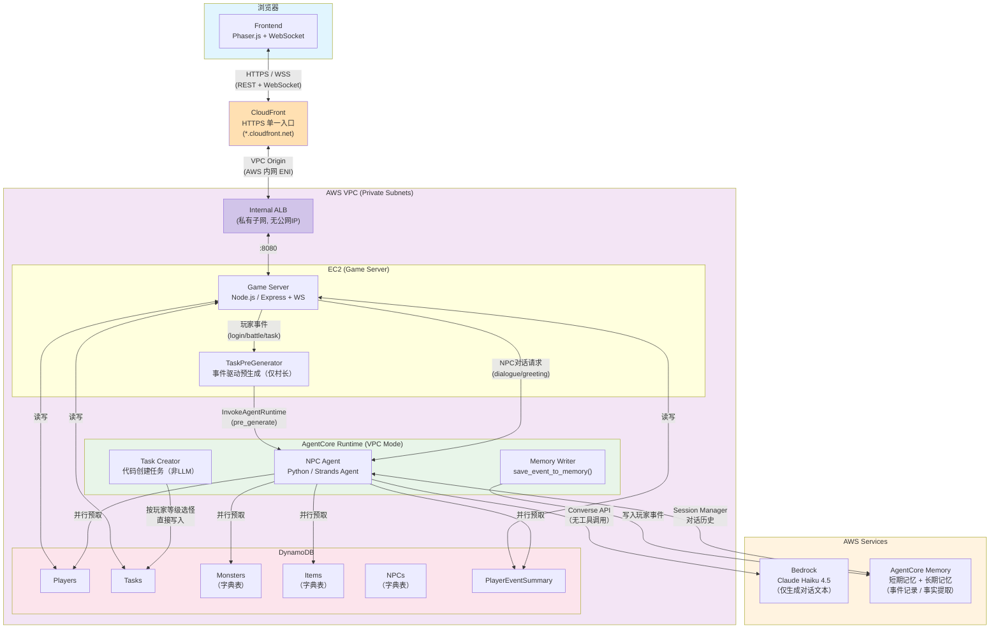
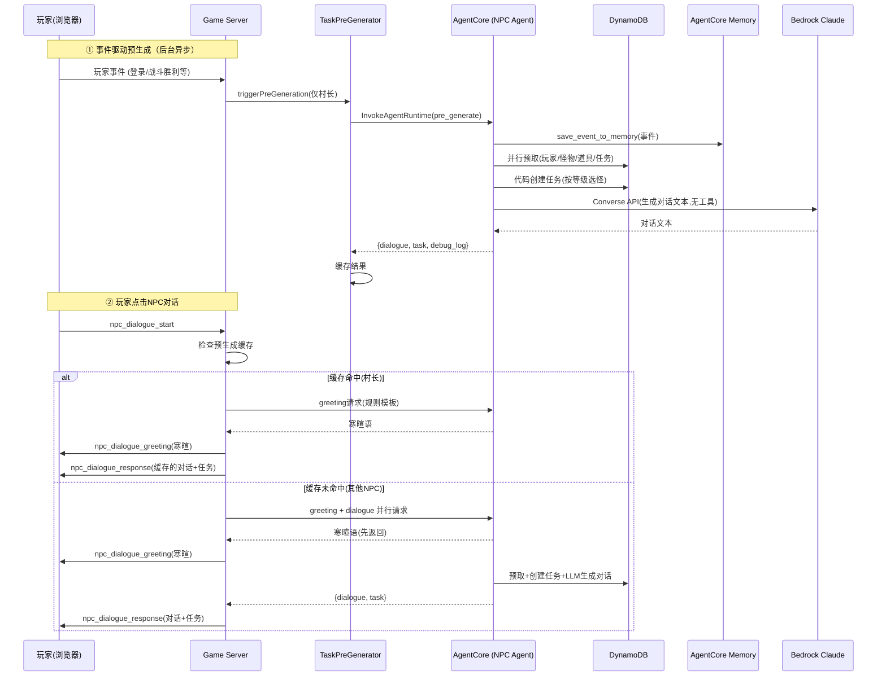

# 项目架构文档（当前实现）

## 1. 项目概述

AI 驱动的 2D RPG 网页游戏 Demo。NPC 通过 Amazon Bedrock Claude Haiku 4.5 + Strands Agent SDK 动态生成对话，代码层从 DynamoDB 字典表预选任务目标并直接创建任务，集成 AgentCore Memory 实现有状态对话记忆，支持事件驱动的预生成机制降低感知延迟。

---

## 2. 部署架构

### 2.1 架构总览（Mermaid）



### 2.2 NPC 对话流程（Mermaid）



### 2.3 部署架构（文本版）

```
浏览器 (Phaser.js)
    ↓ HTTPS / WSS (REST + WebSocket)
CloudFront (HTTPS 单一入口, *.cloudfront.net)
    ↓ VPC Origin (AWS 内网 ENI)
Internal ALB (私有子网, 无公网 IP, 端口 80)
    ↓ :8080 (HTTP, 目标组健康检查 /api/health)
Game Server (Express + WS, EC2 私有子网)
    ├─ AgentCore SDK → AgentCore Runtime (VPC 模式, 容器)
    │                     └─ NPC Agent (Python, Strands Agent)
    │                           ├─ Bedrock Converse API (Claude Haiku 4.5, 纯对话生成)
    │                           ├─ DynamoDB (字典表预取 + 代码创建任务)
    │                           └─ AgentCore Memory (事件写入 + 对话记忆)
    ├─ DynamoDB (玩家/任务/事件持久化)
    └─ SSM Port Forwarding (可选的调试访问)
```

### 2.2 运行模式

| 模式   | 说明                                        | AWS 依赖               |
| ---- | ----------------------------------------- | -------------------- |
| 完整模式 | CloudFront + ALB + EC2 + AgentCore + Bedrock + DynamoDB | 全部 AWS 服务  |
| 生产访问 | 浏览器 → CloudFront (HTTPS) → 内网 ALB → EC2:8080 | CloudFront, ALB, EC2 |
| 本地调试 | SSM 端口转发到 EC2:8080                        | SSM, EC2             |

### 2.3 容器化

| Dockerfile                               | 基础镜像             | 用途                     |
| ---------------------------------------- | ---------------- | ---------------------- |
| `backend/game-server/Dockerfile`         | node:20-alpine   | Game Server 容器         |
| `backend/npc-agent/Dockerfile`           | python:3.12-slim | 本地开发                   |
| `backend/npc-agent/Dockerfile.agentcore` | python:3.12-slim | AgentCore Runtime 生产容器 |

### 2.4 生产环境拓扑

- **入口**: CloudFront (HTTPS, 默认 *.cloudfront.net 证书) → VPC Origin → 内网 ALB (私有子网, 无公网 IP)
- **Frontend**: Vite 构建 → 静态文件由 Game Server Express 提供
- **Game Server**: EC2 (ASG, 私有子网), 经 ALB 访问 (SSM 端口转发作为可选调试通道)
- **NPC Agent**: AgentCore Runtime (VPC 模式, ARM64 容器)
- **数据层**: DynamoDB 6 张表、Bedrock Knowledge Base
- **多区域**: 支持 us-west-2、ap-southeast-1 等区域独立部署，IAM/S3 资源名包含区域后缀避免冲突

---

## 3. 技术栈

### 3.1 前端

| 技术            | 版本     | 用途                |
| ------------- | ------ | ----------------- |
| Phaser        | 3.80.1 | 2D 游戏引擎 (800×600) |
| Vite          | 5.4.0  | 构建工具              |
| WebSocket API | 原生     | 实时通信              |

### 3.2 Game Server

| 技术                                | 用途            |
| --------------------------------- | ------------- |
| Node.js 20 + Express              | HTTP + 静态文件服务 |
| ws                                | WebSocket 服务  |
| @aws-sdk/client-dynamodb          | 数据持久化         |
| @aws-sdk/client-bedrock-agentcore | 调用 NPC Agent  |
| TaskPreGenerator                  | 事件驱动预生成缓存     |

### 3.3 NPC Agent

| 技术                    | 用途                        |
| --------------------- | ------------------------- |
| Python 3.12 + FastAPI | HTTP 框架 (本地调试)            |
| Strands Agent SDK     | Agent 框架 (Tool Use 模式)    |
| BedrockModel          | LLM 调用 (Claude Haiku 4.5) |
| AgentCore Memory      | 有状态对话 (短期+长期记忆)           |
| bedrock-agentcore     | AgentCore Runtime 集成      |
| boto3                 | DynamoDB + KB 查询          |

**LLM 模型**: 根据部署区域自动选择

- US 区域: `us.anthropic.claude-haiku-4-5-20251001-v1:0`
- 非 US 区域: `global.anthropic.claude-haiku-4-5-20251001-v1:0`
- Prompt Caching: `cache_prompt="default"`, `cache_tools="default"`
- Temperature: 0.7, Max Tokens: 1024

### 3.4 数据层

| 服务                     | 用途                                                              |
| ---------------------- | --------------------------------------------------------------- |
| DynamoDB               | 6 张表: Players, Tasks, PlayerEventSummary, Monsters, NPCs, Items |
| Bedrock Knowledge Base | 静态字典数据 (怪物/道具/NPC) 的语义搜索                                        |

---

## 4. NPC Agent 架构

### 4.1 核心组件

```
agent.py                           # 主入口 (FastAPI 本地 + 核心逻辑)
├── agentcore_app.py               # AgentCore Runtime 入口 (生产)
├── memory_config.py               # AgentCore Memory 会话管理
├── db_config.py                   # DynamoDB 连接配置
├── kb_client.py                   # Knowledge Base 查询客户端
├── prompts/
│   └── npc_system_prompt.txt      # System Prompt 模板 (NPC 人格+规则)
├── validation/
│   └── task_validator.py          # 任务校验器 (9 项规则)
└── tools/
    ├── create_task.py             # 创建任务 (唯一的写入工具)
    ├── get_player_info.py         # 查询玩家信息
    ├── get_player_events.py       # 查询玩家行为事件
    ├── get_player_tasks.py        # 查询玩家任务
    ├── get_monsters.py            # 查询怪物字典
    ├── get_items.py               # 查询道具字典
    └── get_npcs.py                # 查询 NPC 字典
```

### 4.2 Agent 工具配置

Agent 仅注册 `create_task` 一个工具。其他数据查询（玩家信息、怪物字典等）通过预取机制在 Agent 调用前并行完成并注入 user message，避免额外工具调用开销。

`tools/` 目录下的其他工具（get_player_info、get_monsters 等）仅用于 `create_task` 内部的校验逻辑，不作为 Agent 工具注册。

### 4.3 Strands Agent 工作流 (2 次 LLM 调用)

```
User Message (玩家数据 + 字典 + 事件日志)
    ↓
LLM Call 1 (~3s): 分析玩家状态 → 决定调用 create_task
    ↓
Tool Execution: create_task → validate_task → DynamoDB 写入 (~100ms)
    ↓
LLM Call 2 (~3s): 基于工具结果生成 NPC 角色对话
    ↓
返回: {dialogue, task, debug_log}
```

**注意**: 2 次 LLM 调用是 Tool Use 模式的必要开销。LLM 第 1 次调用决定工具参数，第 2 次调用基于工具执行结果生成对话。

### 4.4 AgentCore Memory 集成

```python
# memory_config.py
AgentCoreMemoryConfig:
  memory_id = env.AGENTCORE_MEMORY_ID
  actor_id = player_id          # 同一玩家同一上下文
  session_id = f"{player_id}_{npc_id}"  # 每个玩家-NPC 对独立会话

# agent.py
with session_manager as sm:
    agent = Agent(model=bedrock_model, tools=[create_task], session_manager=sm)
    result = agent(user_message)
```

- **短期记忆**: 自动保存/恢复对话轮次
- **长期记忆**: SemanticStrategy (事实提取) + UserPreferenceStrategy (偏好提取)
- **降级模式**: `AGENTCORE_MEMORY_ID` 未设置时 → 无状态模式

### 4.5 数据预取优化

Agent 调用前，并行预取 5 张 DynamoDB 表数据注入 user message，减少工具调用：

```python
ThreadPoolExecutor(max_workers=5):
  - player_info   (Players 表)
  - player_events (PlayerEventSummary 表, 最近 10 条)
  - player_tasks  (Tasks 表, player_id-index)
  - monsters      (Monsters 表 scan)
  - items         (Items 表 scan)
```

可选 Knowledge Base 查询替代 monsters/items 的 DynamoDB scan。

### 4.6 三种调用模式

| 模式             | 触发                | 路由                           |
| -------------- | ----------------- | ---------------------------- |
| `greeting`     | 玩家接近 NPC          | 规则模板 (~100ms, 无 LLM)         |
| `dialogue`     | 玩家对话 NPC          | Strands Agent + Memory (~6s) |
| `pre_generate` | 事件驱动 (战斗/登录/任务完成) | Strands Agent + Memory (异步)  |

---

## 5. 事件驱动预生成架构

### 5.1 概述

玩家事件 (登录、战斗、任务完成、道具使用) 触发异步 LLM 调用，预生成任务和对话缓存到 Game Server。玩家对话 NPC 时即时下发。

### 5.2 流程

```
玩家事件 (battle_victory, player_login, task_completed, item_used, ...)
    ↓ Game Server 触发
TaskPreGenerator.triggerPreGeneration(player_id, event_type, details)
    ↓ 根据 EVENT_NPC_MAPPING 选择 2 个相关 NPC
    ↓ 跳过已缓存/正在生成的 NPC
    ↓ 并行异步 (不阻塞主流程)
AgentCore SDK → NPC Agent → handle_pre_generate(npc_id=指定NPC)
    ├── 检查该 NPC 是否已有 active task (有则跳过)
    ├── 预取数据 + 构建 event-aware prompt (含 NPC 角色约束)
    └── Strands Agent 调用 (Memory + create_task)
    ↓
缓存结果到 TaskPreGenerator (key="playerId_npcId", 5 分钟过期, 一次性消费)
    ↓
玩家对话 NPC 时 → consumePreGenerated(playerId, npcId) → 即时下发
```

**NPC 选择逻辑**: Game Server 端 `EVENT_NPC_MAPPING` 决定每个事件映射哪 2 个 NPC，NPC Agent 端接收指定的 `npc_id` 参数，不再自行选择。

### 5.3 NPC-事件映射 (每事件 2 个 NPC)

| 事件类型           | 选择的 NPC                      | 原因              |
| -------------- | ---------------------------- | --------------- |
| player_login   | npc_elder, npc_healer        | 长老引导 + 药师关怀     |
| battle_victory | npc_elder, npc_blacksmith    | 长老后续任务 + 铁匠装备任务 |
| battle_defeat  | npc_healer, npc_elder        | 药师恢复 + 长老鼓励     |
| task_completed | npc_elder, npc_merchant      | 长老下一任务 + 商人交易   |
| item_used      | npc_healer, npc_merchant     | 药师关注 + 商人推销     |
| item_acquired  | npc_merchant, npc_blacksmith | 商人交易 + 铁匠材料     |
| level_up       | npc_elder, npc_blacksmith    | 长老庆祝 + 铁匠装备     |

### 5.4 NPC 寒暄模板 (规则生成, 无 LLM)

每个 NPC 有 8 种事件类型的独立寒暄模板，支持 `{target}` 变量替换 (通过 DynamoDB 查询解析 ID → 中文名)。寒暄在玩家接近 NPC 时立即返回 (~100ms)，LLM 生成的对话在寒暄播放完后过渡显示。

**游戏事件过滤**: 寒暄语仅基于真实游戏事件生成，过滤掉 `talk_to_npc`、`task_accepted` 等非游戏事件。有效事件类型: `battle_victory`, `battle_defeat`, `task_completed`, `item_acquired`, `item_used`, `level_up`。无游戏事件时使用 `_default` 模板。

**对话去重规则**: 预生成任务对话中不包含称呼（如"勇士"、"冒险者"），因为寒暄语已包含称呼，避免重复。

---

## 6. 前后端通讯

### 6.1 WebSocket (ws://host:8080/ws)

#### 客户端 → 服务端

| 消息类型                 | 参数                                   | 用途        |
| -------------------- | ------------------------------------ | --------- |
| `player_register`    | `{player_id, x, y, character, name}` | 注册在线玩家    |
| `player_move`        | `{player_id, x, y}`                  | 玩家移动      |
| `battle_start`       | `{player_id, monster_id}`            | 发起战斗      |
| `npc_dialogue_start` | `{player_id, npc_id}`                | 发起 NPC 对话 |
| `task_accept`        | `{player_id, task_id, npc_id}`       | 接受任务      |
| `task_reject`        | `{player_id, task_id}`               | 拒绝任务      |
| `task_complete`      | `{player_id, task_id}`               | 完成任务      |
| `use_item`           | `{player_id, item_id}`               | 使用道具      |
| `ping`               | `{}`                                 | 心跳检测      |

#### 服务端 → 客户端

| 消息类型                      | 用途                           |
| ------------------------- | ---------------------------- |
| `connected`               | 连接成功确认                       |
| `players_list`            | 当前在线玩家列表                     |
| `player_join`             | 新玩家上线通知                      |
| `player_moved`            | 其他玩家位置更新                     |
| `player_leave`            | 玩家离线通知                       |
| `npc_dialogue_greeting`   | 规则模板寒暄 (~100ms)              |
| `npc_dialogue_response`   | LLM 对话 + 任务 + debug_log      |
| `battle_end`              | 战斗结果                         |
| `task_accepted`           | 任务接受确认                       |
| `task_rejected`           | 任务拒绝确认                       |
| `task_completed_ack`      | 任务完成确认                       |
| `pre_generation_started`  | 预生成开始通知 (含 npc_ids)          |
| `pre_generation_complete` | 预生成完成通知 (含 npc_id, has_task) |
| `pre_generation_skipped`  | 预生成跳过通知                      |
| `pong`                    | 心跳响应                         |
| `error`                   | 错误信息                         |

### 6.2 REST API

| 方法   | 路径                            | 用途       |
| ---- | ----------------------------- | -------- |
| GET  | `/api/health`                 | 健康检查     |
| POST | `/api/game/start`             | 开始游戏会话   |
| POST | `/api/game/save`              | 保存游戏进度   |
| POST | `/api/game/reset`             | 重置指定玩家数据 |
| POST | `/api/player/create`          | 创建玩家     |
| GET  | `/api/player/:id`             | 获取玩家信息   |
| GET  | `/api/player/:id/inventory`   | 获取玩家背包   |
| GET  | `/api/tasks/:playerId`        | 获取玩家任务列表 |
| POST | `/api/tasks/:taskId/complete` | 完成任务     |
| GET  | `/api/dict/monsters`          | 怪物字典     |
| GET  | `/api/dict/npcs`              | NPC 字典   |
| GET  | `/api/dict/items`             | 道具字典     |

### 6.3 NPC 对话时序

```
1. 玩家接近 NPC → npc_dialogue_start
2. Game Server 检查:
   a. 玩家是否有该 NPC 的 in_progress 任务 → 有则直接提醒
   b. 是否有预生成缓存 (consumePreGenerated) → 有则即时下发
   c. 是否有 in-flight 预生成 (getPendingPromise) → 有则等待
   d. 是否有 pending 任务 → 有则直接下发
   e. 以上都无 → 并行调用 greeting + dialogue (冷路径)
3. 预生成命中路径:
   a. greeting 请求 → AgentCore → 规则模板 (~100ms) → npc_dialogue_greeting
   b. 预生成缓存 → npc_dialogue_response (即时)
4. 冷调用路径:
   a. greeting 先返回 → npc_dialogue_greeting → 前端开始打字机效果
   b. dialogue 返回 → npc_dialogue_response → 前端过渡到任务对话
```

---

## 7. 前端 UI 系统

### 7.1 对话框 (DialogueBox.js)

- 打字机效果: 100ms/字符 (寒暄和对话一致)
- 状态机: waiting → showGreeting → isWaitingAfterGreeting → transitionToDialogue
- 任务显示: 中文名 (通过 MONSTER_DICT/ITEM_DICT/NPC_DICT 解析 ID)
- 按钮: [接受任务] + [关闭], Enter 接受/关闭, Escape 关闭

### 7.2 Agent Console

右侧面板实时显示 NPC Agent 调试日志:

- `[Memory]` — Memory 状态 (ON/OFF)
- `[LLM]` — 模型配置 (model_id, region, cache)
- `[KB]` — Knowledge Base 查询结果
- `[MCP Tool]` — 工具调用 (create_task 参数和结果)
- `⏱` — 时序信息 (总耗时, agent 耗时)
- `⚡ [Pre-Generated]` — 预生成命中
- `📚/🧠/🗄️ [DynamoDB/KB/Memory]` — 数据预取来源

---

## 8. AI 任务系统

### 8.1 NPC 角色与任务类型

| NPC  | npc_id         | 角色              | 任务方向                    |
| ---- | -------------- | --------------- | ----------------------- |
| 村长老莫 | npc_elder      | 村庄长老，新手引导和主线任务  | kill_monster            |
| 铁匠格雷 | npc_blacksmith | 武器店铁匠，装备强化和材料收集 | collect_item            |
| 商人莉娜 | npc_merchant   | 流浪商人，道具交易和情报线索  | use_item / collect_item |
| 药师艾琳 | npc_healer     | 教堂药师，药水和恢复类道具   | use_item                |

### 8.2 任务校验规则 (validation/task_validator.py)

1. 结构完整性: title, description, conditions, awards 非空
2. npc_id 存在于 NPCs 表
3. conditions.type 合法 (kill_monster/collect_item/talk_to_npc/use_item)
4. conditions.target_id 存在于对应字典表
5. conditions.required_count 范围: 1-99
6. awards.item_id 存在于 Items 表
7. 数值范围: 金币 1-1000, 经验 1-500, 道具数量 1-99
8. 任务去重: 不与 pending/in_progress/completed 任务的 conditions 组合重复
9. 怪物等级匹配: kill_monster 目标怪物等级 = 玩家等级

### 8.3 System Prompt 策略

- NPC 人格注入: `{npc_name}`, `{npc_role}`, `{npc_personality}`
- 任务类型限制: 每个 NPC 只能发布指定类型
- NPC 角色约束: 预生成 prompt 明确要求任务必须符合 NPC 职责和专长（如药师只能下发恢复类任务）
- 对话要求: 极简 (1-2 句, 30 字以内), 明确说出任务内容
- 反重复: 寒暄语已单独生成，对话不重复提及玩家最近事件
- 去称呼: 预生成对话不使用"勇士"、"冒险者"等称呼（寒暄语已包含）
- 严格输出: 只输出角色对话，禁止元信息

---

## 9. 部署流程

### 9.1 deploy.sh 选项

支持多区域部署，IAM 角色和 S3 桶名包含 `${AWS::Region}` 避免跨区域冲突。

```bash
./infra/deploy.sh --env dev --region us-west-2              # 全量部署 (US)
./infra/deploy.sh --env dev --region ap-southeast-1         # 全量部署 (新加坡)
./infra/deploy.sh --env dev --region us-west-2 --stack-only       # 仅 CloudFormation
./infra/deploy.sh --env dev --region us-west-2 --gameserver-only  # 仅 Game Server + Frontend
./infra/deploy.sh --env dev --region us-west-2 --agentcore-only   # 仅 NPC Agent (AgentCore)
./infra/deploy.sh --env dev --region us-west-2 --seed-only        # 仅种子数据
```

### 9.2 AgentCore 部署流程

1. Docker build (ARM64) → ECR push (带时间戳 tag)
2. 创建/更新 AgentCore Runtime (VPC 模式, 私有子网)
3. 删除旧 endpoint → 创建新 endpoint (强制容器重新部署)
4. 等待 endpoint READY

### 9.3 Game Server 部署流程

1. Vite build frontend → 打包 game-server + frontend + node_modules
2. Upload zip to S3
3. SSM 命令: 下载 zip → 解压 → 同步 AgentCore endpoint name → 重启服务

### 9.4 Endpoint 名称同步

`--gameserver-only` 部署时自动从 AgentCore 获取最新 endpoint name 和 runtime ARN，通过 `sed` 写入 EC2 的 `.env` 文件。

全量部署时，由于 AgentCore 在 Game Server 之后部署，会额外执行 `sync_agentcore_endpoint_to_ec2` 步骤：

```
deploy_stack → deploy_game_server_code → deploy_agentcore → deploy_stack → sync_agentcore_endpoint_to_ec2 → seed_tables
```

同步内容: `AGENTCORE_ENDPOINT_NAME` + `AGENTCORE_RUNTIME_ARN` → EC2 `/opt/game-server/.env`，然后重启 game-server 服务。

### 9.4.1 CloudFront + ALB 安全组两阶段收紧

CloudFront 通过 VPC Origin 直连内网 ALB，ALB 安全组按最小暴露原则分两个阶段自动收紧（全量部署时 `deploy_stack` 被调用两次，天然完成两阶段）：

- **阶段 1（首次部署）**：VPC Origin 尚未创建，其服务托管安全组还不存在。`deploy.sh` 解析 CloudFront 官方托管前缀列表 `com.amazonaws.global.cloudfront.origin-facing`，ALB 安全组仅放行来自该前缀列表（CloudFront 边缘节点 IP）的 80 端口。
- **阶段 2（再次部署）**：VPC Origin 创建后 AWS 自动生成服务托管安全组 `CloudFront-VPCOrigins-Service-SG`。`deploy.sh` 检测到后，改为仅放行来自该 SG 的入站，并**移除前缀列表规则**——此时 ALB 只接受本 CloudFront 分发的流量（最严格）。

EC2 安全组则始终只放行来自 ALB 安全组的 8080 端口。相关 CloudFormation 参数：`CloudFrontPrefixListId`、`CloudFrontVpcOriginSecurityGroupId`（均由 `deploy.sh` 自动注入，无需手动传参）。

> 注意：修改 EC2/ALB 安全组的 `description` 会触发安全组替换，而 ASG 中运行的实例不会自动更换安全组，导致旧 SG 因被 ENI 占用而删除失败、ALB 健康检查超时。此时需执行 `aws autoscaling start-instance-refresh`（单实例可加 `--preferences MinHealthyPercentage=0`）刷新实例。

### 9.5 部署后访问

**生产访问（CloudFront）**：部署完成后，游戏通过 CloudFront 分配的 HTTPS 域名对外访问。整条链路为
`浏览器 → CloudFront (HTTPS) → VPC Origin → 内网 ALB → EC2:8080`，
EC2 和 ALB 均在私有子网、无公网 IP，CloudFront 是唯一公网入口。

从 CloudFormation 输出获取访问地址：

```bash
REGION=us-west-2  # 或 ap-southeast-1
STACK_NAME=game-demo-dev

aws cloudformation describe-stacks \
  --stack-name ${STACK_NAME} \
  --query "Stacks[0].Outputs[?OutputKey=='CloudFrontDomainName'].OutputValue" \
  --output text --region ${REGION}
# 输出形如: https://d3th444jsi5cf8.cloudfront.net
```

浏览器直接打开该地址即可访问游戏（前端使用相对路径，REST/WebSocket 自动走 CloudFront，
HTTPS 下 WebSocket 自动升级为 WSS）。`deploy.sh` 在部署结束时也会打印该地址。

> CloudFront 首次创建需 ~10-15 分钟完成全球分发后才可访问。

**调试访问（SSM 端口转发，可选）**：绕过 CloudFront/ALB 直连 EC2，用于排查问题。

```bash
INSTANCE_ID=$(aws autoscaling describe-auto-scaling-groups \
  --auto-scaling-group-names "$(aws cloudformation describe-stacks \
    --stack-name ${STACK_NAME} \
    --query "Stacks[0].Outputs[?OutputKey=='GameServerASGName'].OutputValue" \
    --output text --region ${REGION})" \
  --query "AutoScalingGroups[0].Instances[0].InstanceId" \
  --output text --region ${REGION})

aws ssm start-session \
  --target ${INSTANCE_ID} \
  --document-name AWS-StartPortForwardingSession \
  --parameters '{"portNumber":["8080"],"localPortNumber":["8080"]}' \
  --region ${REGION}
# 然后浏览器打开 http://localhost:8080
```

### 9.6 运维命令

**查看 Game Server 日志**:

```bash
aws ssm send-command \
  --instance-ids ${INSTANCE_ID} \
  --document-name AWS-RunShellScript \
  --parameters 'commands=["journalctl -u game-server --no-pager -n 100"]' \
  --region ${REGION} \
  --query "Command.CommandId" --output text
```

**重启 Game Server**:

```bash
aws ssm send-command \
  --instance-ids ${INSTANCE_ID} \
  --document-name AWS-RunShellScript \
  --parameters 'commands=["systemctl restart game-server"]' \
  --region ${REGION}
```

**查看 EC2 环境变量**:

```bash
aws ssm send-command \
  --instance-ids ${INSTANCE_ID} \
  --document-name AWS-RunShellScript \
  --parameters 'commands=["cat /opt/game-server/.env"]' \
  --region ${REGION} \
  --query "Command.CommandId" --output text
```

**查看 AgentCore Runtime 状态**:

```bash
aws bedrock-agentcore-control list-agent-runtimes \
  --query "agentRuntimes[?agentRuntimeName=='game_demo_npc_agent_dev'].[agentRuntimeId,status]" \
  --output text --region ${REGION}
```

**查看 AgentCore Endpoint 状态**:

```bash
RUNTIME_ID=<从上一条命令获取>
aws bedrock-agentcore-control list-agent-runtime-endpoints \
  --agent-runtime-id ${RUNTIME_ID} \
  --query "runtimeEndpoints[*].[name,status]" \
  --output text --region ${REGION}
```
