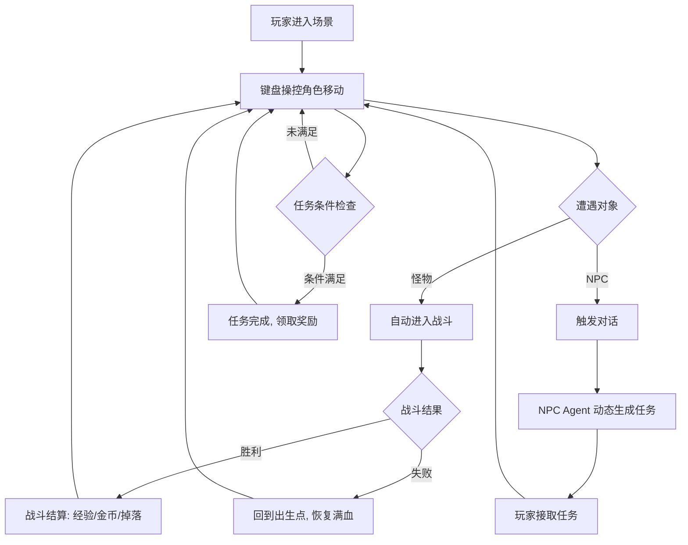
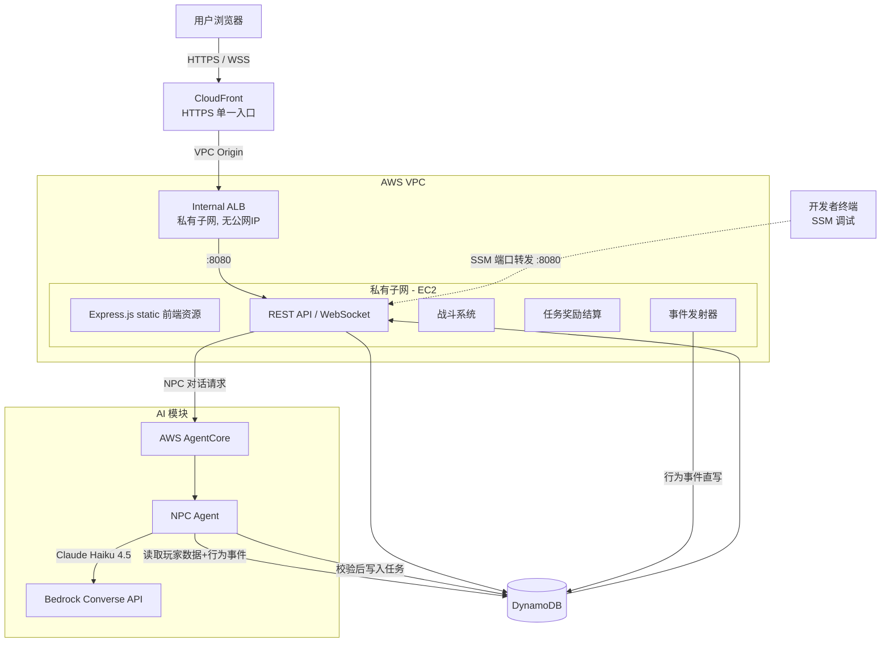
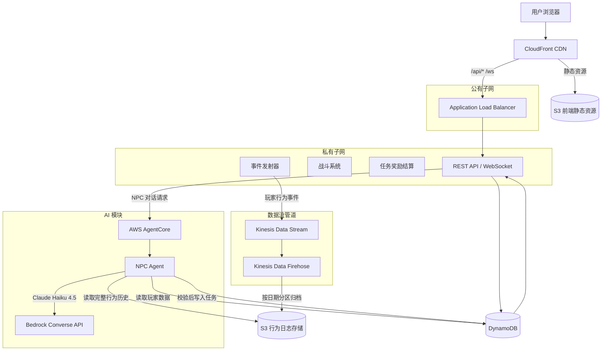
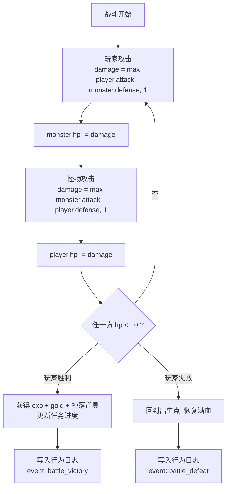
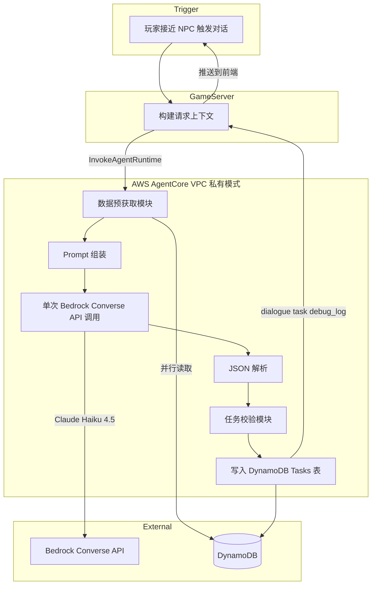
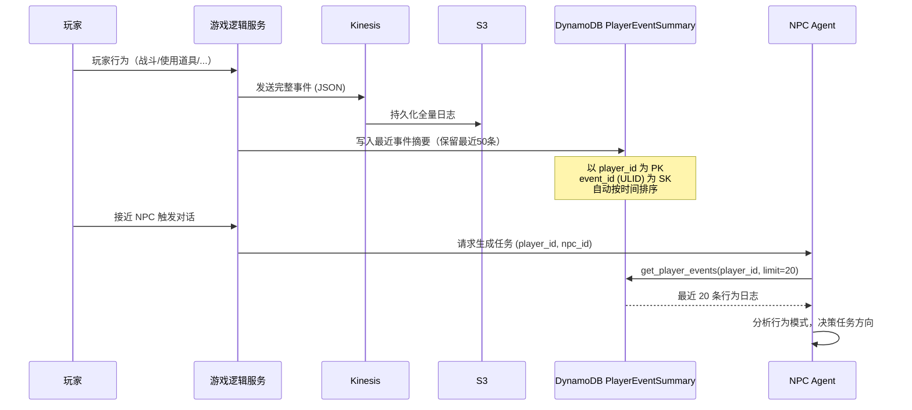
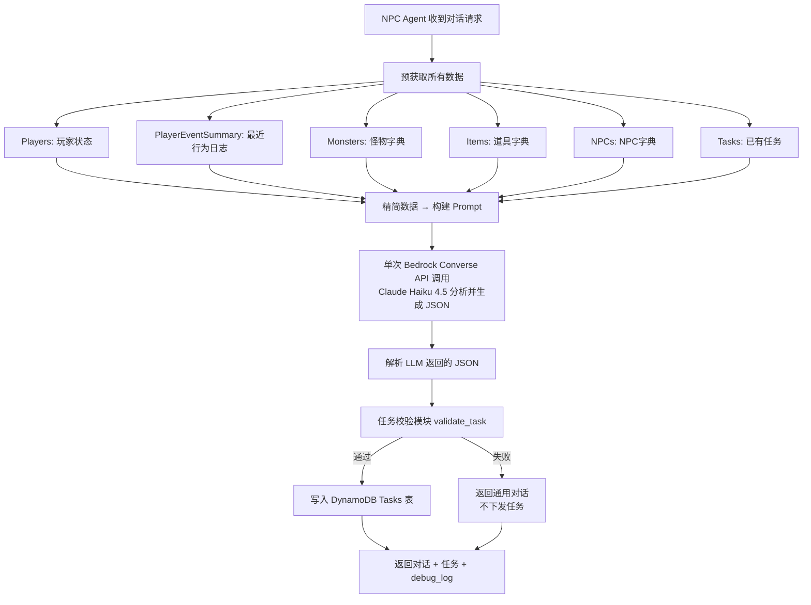
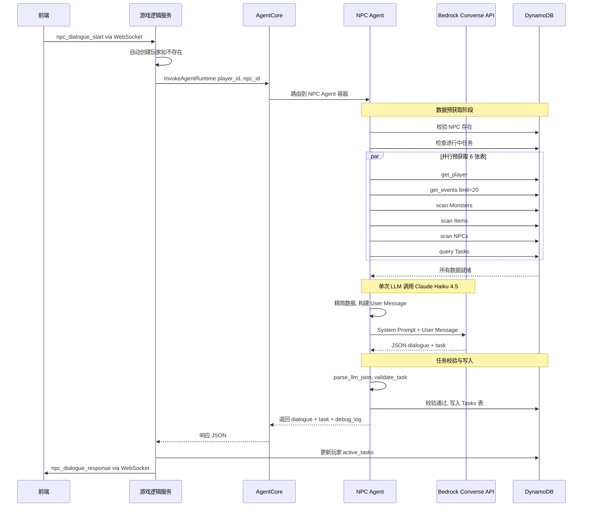
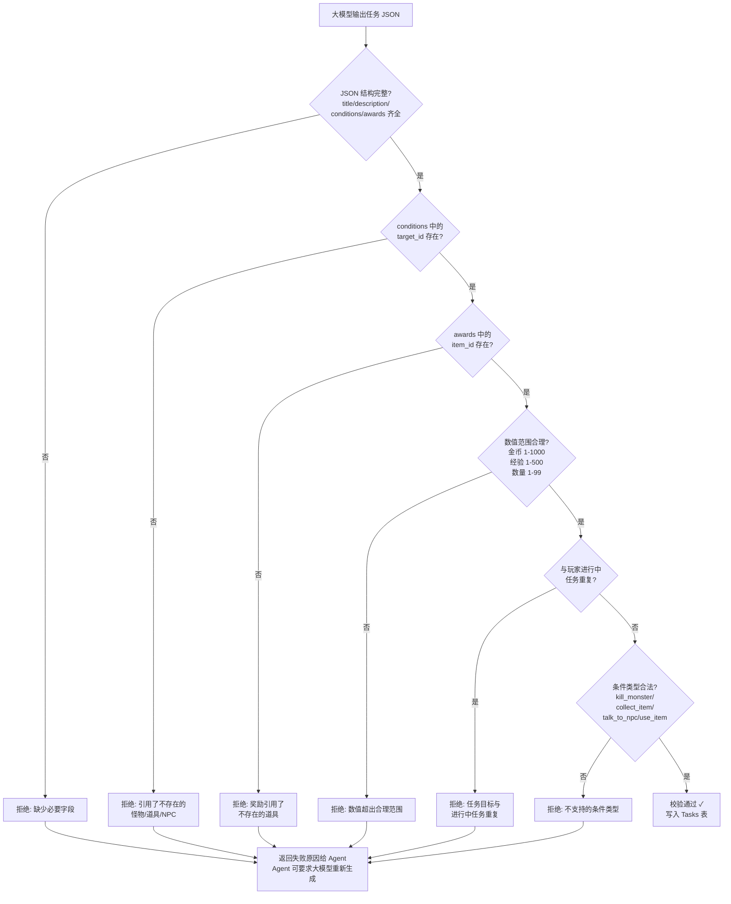
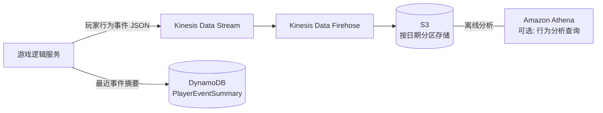

# 游戏 Demo 设计文档

## 1. 概述

本项目是一个轻量级网页游戏 Demo，核心玩法为：玩家通过键盘操控角色，在场景中与怪物战斗、与 NPC 对话并接取任务。Demo 的核心展示点是 **AI 驱动的智能 NPC**——NPC 通过 AI 大模型动态生成任务，而非使用预设的静态任务池。

NPC Agent 会综合分析玩家的实时数据和历史行为日志，动态调整任务内容：击杀成功则引导挑战更强敌人，战斗失败则引导收集装备提升实力。所有生成的任务经过严格校验后写入任务表，确保可执行。

技术架构基于 AWS 云服务，前端为网页端，后端包含游戏逻辑服务、数据处理管道、AI Agent 模块和数据存储层。

---

## 2. 游戏流程设计

### 2.1 核心场景流程



### 2.2 场景地图

Demo 使用一个简单的 2D 俯视角地图，包含以下区域：

| 区域 | 说明 |
|------|------|
| 出生点 | 玩家初始位置 |
| 怪物区 | 放置若干怪物，玩家靠近后触发战斗 |
| NPC 区 | 放置 NPC，玩家靠近后触发对话 |

### 2.3 操控与交互

| 操作 | 按键 | 说明 |
|------|------|------|
| 移动 | WASD / 方向键 | 上下左右移动角色 |
| 战斗 | 自动触发 | 角色与怪物碰撞时进入战斗 |
| 对话 | 自动触发 | 角色与 NPC 碰撞时打开对话框 |

---

## 3. 数据模型设计

### 3.1 玩家（Player）

| 字段 | 类型 | 说明 |
|------|------|------|
| player_id | String (PK) | 玩家唯一标识 |
| name | String | 玩家名称 |
| level | Number | 等级 |
| exp | Number | 当前经验值 |
| exp_to_next_level | Number | 升级所需经验 |
| gold | Number | 金币 |
| hp | Number | 当前生命值 |
| max_hp | Number | 最大生命值 |
| attack | Number | 攻击力 |
| defense | Number | 防御力 |
| inventory | List | 背包道具列表 `[{item_id, quantity}]` |
| active_tasks | List | 进行中的任务 ID 列表 |
| completed_tasks | List | 已完成的任务 ID 列表 |
| position_x | Number | 地图 X 坐标 |
| position_y | Number | 地图 Y 坐标 |
| created_at | String | 创建时间 |
| updated_at | String | 更新时间 |

### 3.2 怪物字典（Monster）

怪物为字典配置，每次场景加载时按字典模板生成实例。**所有怪物必须预先定义在字典表中**，NPC Agent 生成的任务只能引用字典中已有的 monster_id。

**字段定义：**

| 字段 | 类型 | 说明 |
|------|------|------|
| monster_id | String (PK) | 怪物 ID |
| name | String | 怪物名称 |
| level | Number | 怪物等级（用于难度排序） |
| hp | Number | 生命值 |
| attack | Number | 攻击力 |
| defense | Number | 防御力 |
| exp_reward | Number | 击杀经验奖励 |
| gold_reward | Number | 击杀金币奖励 |
| drop_items | List | 掉落道具列表 `[{item_id, probability}]` |
| sprite | String | 怪物贴图资源标识 |

**预置怪物字典数据：**

| monster_id | name | level | hp | attack | defense | exp_reward | gold_reward | drop_items |
|------------|------|-------|----|--------|---------|------------|-------------|------------|
| `slime_01` | 史莱姆 | 1 | 30 | 5 | 2 | 10 | 5 | `[{leather_scrap, 0.5}]` |
| `goblin_01` | 哥布林 | 2 | 60 | 12 | 5 | 25 | 15 | `[{iron_ore, 0.4}, {hp_potion_s, 0.3}]` |
| `wolf_01` | 灰狼 | 3 | 90 | 18 | 8 | 45 | 25 | `[{wolf_fang, 0.5}, {leather_scrap, 0.6}]` |
| `orc_01` | 兽人战士 | 4 | 150 | 25 | 15 | 80 | 50 | `[{iron_ore, 0.6}, {orc_shield_fragment, 0.3}]` |
| `dragon_01` | 幼龙 | 5 | 250 | 35 | 20 | 150 | 100 | `[{dragon_scale, 0.4}, {flame_gem, 0.2}]` |

### 3.3 NPC 字典

**NPC 必须从字典表中取，不能动态创建。** 玩家对话的 NPC、任务中 `talk_to_npc` 条件引用的 NPC，都必须是字典表中已存在的记录。NPC Agent 在生成任务时，只能使用字典中已有的 `npc_id`。

**字段定义：**

| 字段 | 类型 | 说明 |
|------|------|------|
| npc_id | String (PK) | NPC 唯一标识 |
| name | String | NPC 名称 |
| role | String | NPC 角色描述（用于 AI prompt 构建） |
| personality | String | NPC 性格描述（用于 AI prompt 构建） |
| position_x | Number | 地图 X 坐标 |
| position_y | Number | 地图 Y 坐标 |
| sprite | String | NPC 贴图资源标识 |

**预置 NPC 字典数据：**

| npc_id | name | role | personality | position_x | position_y |
|--------|------|------|-------------|------------|------------|
| `npc_elder` | 村长老莫 | 村庄长老，负责新手引导和主线任务推进 | 慈祥稳重，说话简洁，喜欢用谚语教导年轻人 | 500 | 300 |
| `npc_blacksmith` | 铁匠格雷 | 武器店铁匠，指导玩家装备强化和材料收集 | 粗犷豪爽，热情直率，对武器和装备充满热忱 | 350 | 450 |
| `npc_merchant` | 商人莉娜 | 流浪商人，提供道具交易相关任务和情报线索 | 精明狡黠，话语间夹带商业推销，但本性善良 | 650 | 400 |
| `npc_healer` | 药师艾琳 | 教堂药师，引导玩家使用药水和恢复类道具 | 温柔细心，关心玩家的健康状态，说话轻声细语 | 480 | 250 |
| `npc_scout` | 斥候阿克 | 前线斥候，发布与怪物战斗和探索相关的任务 | 冷静干练，军事化用语，重视情报和战术 | 700 | 550 |

> **约束规则**：游戏逻辑服务在触发 NPC 对话时，必须传入一个已存在于字典表中的 `npc_id`。NPC Agent 的 `create_task` 校验逻辑中，`talk_to_npc` 类型条件的 `target_id` 也必须在该字典表中存在。

### 3.4 任务（Task）

任务由 AI 动态生成，经校验后写入数据库，结构统一。

| 字段 | 类型 | 说明 |
|------|------|------|
| task_id | String (PK) | 任务唯一标识 |
| player_id | String (GSI) | 所属玩家 |
| npc_id | String | 发布该任务的 NPC |
| title | String | 任务标题 |
| description | String | 任务描述文本 |
| status | String | 任务状态：`pending` / `in_progress` / `completed` |
| conditions | List | 完成条件列表（见下方结构） |
| awards | List | 奖励列表（见下方结构） |
| created_at | String | 创建时间 |
| completed_at | String | 完成时间 |

**完成条件结构 (`conditions` 中的元素)：**

```json
{
  "type": "kill_monster",
  "target_id": "monster_001",
  "required_count": 3,
  "current_count": 0
}
```

支持的条件类型：

| 类型 | 说明 | target_id 含义 |
|------|------|---------------|
| `kill_monster` | 击杀指定怪物 | 怪物模板 ID |
| `collect_item` | 收集指定道具 | 道具 ID |
| `talk_to_npc` | 与指定 NPC 对话 | NPC ID |
| `use_item` | 使用指定道具 | 道具 ID |

### 3.5 奖励（Award）

奖励不单独建表，作为任务的嵌套结构存储。

**奖励结构 (`awards` 中的元素)：**

```json
{
  "type": "gold",
  "value": 100,
  "item_id": null,
  "quantity": null
}
```

| 类型 | 说明 |
|------|------|
| `gold` | 金币奖励，`value` 为金币数量 |
| `exp` | 经验奖励，`value` 为经验值 |
| `item` | 道具奖励，通过 `item_id` + `quantity` 指定 |

### 3.6 道具字典（Item）

**所有道具必须预先定义在字典表中。** NPC Agent 生成任务时，`conditions` 和 `awards` 中引用的 `item_id` 都必须来自该字典表。

**字段定义：**

| 字段 | 类型 | 说明 |
|------|------|------|
| item_id | String (PK) | 道具唯一标识 |
| name | String | 道具名称 |
| description | String | 道具描述 |
| type | String | 道具类型：`consumable` / `equipment` / `material` / `gift_pack` |
| sub_type | String | 子类型（equipment 时）：`weapon` / `armor` / `accessory` |
| effect | Map | 使用效果 |
| sprite | String | 道具图标资源标识 |

**预置道具字典数据：**

#### 消耗品（consumable）

| item_id | name | description | type | effect |
|---------|------|-------------|------|--------|
| `hp_potion_s` | 小生命药水 | 恢复 30 点生命值 | consumable | `{"hp_restore": 30}` |
| `hp_potion_m` | 中生命药水 | 恢复 80 点生命值 | consumable | `{"hp_restore": 80}` |
| `hp_potion_l` | 大生命药水 | 恢复 200 点生命值 | consumable | `{"hp_restore": 200}` |
| `atk_potion` | 力量药剂 | 攻击力临时提升 10，持续 3 场战斗 | consumable | `{"attack_boost": 10, "duration_battles": 3}` |
| `def_potion` | 铁壁药剂 | 防御力临时提升 10，持续 3 场战斗 | consumable | `{"defense_boost": 10, "duration_battles": 3}` |

#### 装备 - 武器（equipment / weapon）

| item_id | name | description | type | sub_type | effect |
|---------|------|-------------|------|----------|--------|
| `wooden_sword` | 木剑 | 新手武器，聊胜于无 | equipment | weapon | `{"attack": 3}` |
| `iron_sword` | 铁剑 | 可靠的铁制长剑 | equipment | weapon | `{"attack": 8}` |
| `steel_sword` | 钢剑 | 精锻钢制长剑，锋利无比 | equipment | weapon | `{"attack": 15}` |
| `flame_blade` | 烈焰之刃 | 附着火焰魔力的武器 | equipment | weapon | `{"attack": 25, "fire_damage": 5}` |

#### 装备 - 护具（equipment / armor）

| item_id | name | description | type | sub_type | effect |
|---------|------|-------------|------|----------|--------|
| `cloth_armor` | 布甲 | 简单的布制衣物 | equipment | armor | `{"defense": 2}` |
| `leather_armor` | 皮甲 | 皮革制作的轻便护甲 | equipment | armor | `{"defense": 5}` |
| `iron_armor` | 铁甲 | 坚固的铁制护甲 | equipment | armor | `{"defense": 12}` |
| `dragon_armor` | 龙鳞甲 | 由龙鳞打造的传说护甲 | equipment | armor | `{"defense": 22, "max_hp": 50}` |

#### 装备 - 饰品（equipment / accessory）

| item_id | name | description | type | sub_type | effect |
|---------|------|-------------|------|----------|--------|
| `lucky_ring` | 幸运戒指 | 提升道具掉落概率 | equipment | accessory | `{"drop_rate_boost": 0.1}` |
| `warrior_amulet` | 勇士护符 | 全面提升少量战斗属性 | equipment | accessory | `{"attack": 3, "defense": 3, "max_hp": 20}` |

#### 材料（material）

| item_id | name | description | type | effect |
|---------|------|-------------|------|--------|
| `leather_scrap` | 皮革碎片 | 击杀野兽掉落，可制作皮甲 | material | — |
| `iron_ore` | 铁矿石 | 击杀哥布林掉落，可锻造铁制装备 | material | — |
| `wolf_fang` | 狼牙 | 击杀灰狼掉落，可制作饰品 | material | — |
| `orc_shield_fragment` | 兽人盾碎片 | 击杀兽人掉落，可强化护甲 | material | — |
| `dragon_scale` | 龙鳞 | 击杀幼龙掉落，传说级材料 | material | — |
| `flame_gem` | 火焰宝石 | 击杀幼龙稀有掉落，附魔武器用 | material | — |

#### 礼包（gift_pack）

礼包为复合道具，使用后拆解为多个子道具。

| item_id | name | description | type | effect |
|---------|------|-------------|------|--------|
| `starter_pack` | 新手礼包 | 包含新手必备物品 | gift_pack | `{"contains": [{"item_id": "hp_potion_s", "quantity": 5}, {"item_id": "wooden_sword", "quantity": 1}, {"item_id": "cloth_armor", "quantity": 1}]}` |
| `warrior_pack` | 战士补给包 | 为战斗准备的补给 | gift_pack | `{"contains": [{"item_id": "hp_potion_m", "quantity": 3}, {"item_id": "atk_potion", "quantity": 2}, {"item_id": "def_potion", "quantity": 2}]}` |
| `treasure_box` | 宝藏箱 | 打开后随机获得装备或材料 | gift_pack | `{"random_one_of": [{"item_id": "iron_sword"}, {"item_id": "leather_armor"}, {"item_id": "lucky_ring"}, {"item_id": "iron_ore", "quantity": 5}]}` |

### 3.7 玩家行为日志（Player Event Log）

行为日志通过 Kinesis 写入 S3，同时在 DynamoDB 中维护最近 N 条摘要供 NPC Agent 实时查询。

**DynamoDB 行为摘要表（`PlayerEventSummary`）：**

| 字段 | 类型 | 说明 |
|------|------|------|
| player_id | String (PK) | 玩家 ID |
| event_id | String (SK) | 事件 ID（ULID，自带时间排序） |
| event_type | String | 事件类型 |
| target_id | String | 相关目标 ID（怪物/道具/NPC） |
| result | String | 事件结果：`success` / `failure` |
| details | Map | 事件详细数据 |
| timestamp | String | 事件时间 |

支持的事件类型：

| event_type | 说明 | details 示例 |
|------------|------|-------------|
| `battle_victory` | 战斗胜利 | `{"monster_id": "m01", "damage_taken": 30, "rounds": 5}` |
| `battle_defeat` | 战斗失败 | `{"monster_id": "m02", "player_hp_left": 0, "monster_hp_left": 45}` |
| `task_completed` | 任务完成 | `{"task_id": "t01", "awards": [...]}` |
| `item_acquired` | 获得道具 | `{"item_id": "i01", "source": "drop"}` |
| `item_used` | 使用道具 | `{"item_id": "i01", "effect": "hp_restore"}` |
| `level_up` | 玩家升级 | `{"old_level": 2, "new_level": 3}` |

---

## 4. 系统架构设计

### 4.1 整体架构

> **详细的 AWS 架构图请参见 [`architecture.drawio`](./architecture.drawio)**，包含两页：
> - **Page 1: 整体系统架构** — 所有 AWS 服务及数据流向，使用 AWS 官方图标
> - **Page 2: AI 模块 - NPC Agent 架构** — NPC Agent 内部 Tools、任务校验、动态决策流程

#### 4.1.1 当前 Demo 架构（已实现）

玩家浏览器通过 CloudFront（HTTPS 单一入口）经 VPC Origin 访问私有子网中的内网 ALB，再转发到 EC2 上的 Game Server（前后端同进程）。玩家行为事件直接写入 DynamoDB，无数据流管道。EC2/ALB 均无公网 IP，CloudFront 是唯一公网入口；SSM 端口转发保留作为可选调试通道。



**架构说明：**
- 玩家访问入口为 CloudFront（HTTPS，默认 `*.cloudfront.net` 证书），经 VPC Origin 直连私有子网的内网 ALB，再转发到 EC2:8080
- 前端静态资源由 EC2 通过 Express.js `express.static` 提供（**非** S3 Origin），前后端在同一进程；REST 与 WebSocket 均走同一 CloudFront 分发
- 内网 ALB 无公网 IP，安全组两阶段收紧为仅接受 CloudFront 流量（详见 `architecture-analysis.md` §9.4.1）；EC2 安全组仅放行来自 ALB 的 8080
- SSM Session Manager 端口转发保留为可选调试通道（绕过 CloudFront/ALB 直连 EC2）
- 玩家行为事件由 EventEmitter 直写 DynamoDB `PlayerEventSummary` 表，无 Kinesis/S3 管道
- NPC Agent 从 DynamoDB 读取最近 20 条行为事件作为 LLM context
- EC2 与 AgentCore 运行在私有子网，通过 VPC Endpoints 访问 AWS 服务（无 NAT Gateway）

#### 4.1.2 正式生产架构（目标）

前端通过 ALB 访问后端，玩家行为事件走 Kinesis 数据流管道持久化到 S3，NPC Agent 从 S3 读取完整行为历史作为 context。

> **与 4.1.1 已实现架构的差异**：本目标架构额外引入 S3 前端 Origin（静态资源与 API 分离）和 Kinesis→Firehose→S3 行为日志管道，尚未实现。此外，已实现架构采用 **CloudFront VPC Origin + 内网 ALB**（ALB 在私有子网、无公网 IP），比本图中的"公有子网 ALB"暴露面更小。



**架构说明：**
- CloudFront 作为统一入口，静态资源走 S3 Origin，API/WebSocket 走 ALB Origin
- ALB 位于公有子网，将请求路由到私有子网的 EC2 游戏服务器
- 玩家行为事件通过 Kinesis Data Stream → Firehose → S3 持久化，按日期分区存储
- NPC Agent 从 S3 读取完整的玩家行为历史（而非仅最近 N 条），支持更深度的行为分析
- AgentCore Runtime 运行在 VPC 私有子网，通过 VPC Endpoints 访问 DynamoDB 和 Bedrock（无 NAT Gateway）

### 4.1.3 VPC 网络设计（无 NAT Gateway）

Demo 架构中，EC2 和 AgentCore 均运行在 VPC 私有子网，**不使用 NAT Gateway**，所有 AWS 服务通过 VPC Endpoints 访问，节省成本约 $32/月。

#### 网络拓扑

```
┌─────────────────────────────────────────────────────────┐
│  VPC 10.0.0.0/16                                        │
│                                                         │
│  ┌─ 公有子网 ──────────────┐                            │
│  │  10.0.1.0/24, 10.0.2.0/24                           │
│  │  IGW (VPC Origins 前置要求，不承载业务流量)          │
│  └─────────────────────────┘                            │
│                                                         │
│  CloudFront ──VPC Origin(内网 ENI)──→ 内网 ALB(私有子网) │
│                                                         │
│  ┌─ 私有子网 ──────────────┐     ┌─ VPC Endpoints ───┐  │
│  │  10.0.3.0/24, 10.0.4.0/24    │                    │  │
│  │                         │     │  Gateway (免费):   │  │
│  │  内网 ALB ──────────────┼─:8080─→ EC2 游戏服务器   │  │
│  │  EC2 游戏服务器 ────────┼────→│   · DynamoDB      │  │
│  │  AgentCore Runtime ─────┼────→│   · S3            │  │
│  │                         │     │                    │  │
│  │                         │     │  Interface (ENI):  │  │
│  │                         ├────→│   · bedrock-runtime│  │
│  │                         ├────→│   · bedrock-agentcore│ │
│  │                         ├────→│   · bedrock-agentcore│ │
│  │                         │     │     .gateway       │  │
│  │                         ├────→│   · sts            │  │
│  │                         ├────→│   · ecr.api/dkr    │  │
│  │                         ├────→│   · ssm            │  │
│  │                         ├────→│   · ssmmessages   │  │
│  │                         ├────→│   · ec2messages   │  │
│  └─────────────────────────┘     └────────────────────┘  │
└─────────────────────────────────────────────────────────┘
```

#### VPC Endpoints 清单

| Endpoint | 类型 | 用途 | 费用 |
|----------|------|------|------|
| `com.amazonaws.{region}.dynamodb` | Gateway | EC2/AgentCore 读写 DynamoDB | 免费 |
| `com.amazonaws.{region}.s3` | Gateway | EC2 从 S3 下载代码包、AL2023 dnf 包管理 | 免费 |
| `com.amazonaws.{region}.bedrock-runtime` | Interface | AgentCore 调用 Bedrock Converse API | ~$7.2/月 (ENI) |
| `com.amazonaws.{region}.bedrock-agentcore` | Interface | EC2 调用 AgentCore InvokeAgentRuntime | ~$7.2/月 (ENI) |
| `com.amazonaws.{region}.bedrock-agentcore.gateway` | Interface | AgentCore 容器运行时通信通道 | ~$7.2/月 (ENI) |
| `com.amazonaws.{region}.sts` | Interface | AgentCore 容器获取 IAM 凭证 | ~$7.2/月 (ENI) |
| `com.amazonaws.{region}.ecr.api` | Interface | AgentCore 容器镜像拉取（API） | ~$7.2/月 (ENI) |
| `com.amazonaws.{region}.ecr.dkr` | Interface | AgentCore 容器镜像拉取（Docker） | ~$7.2/月 (ENI) |
| `com.amazonaws.{region}.ssm` | Interface | SSM Session Manager 端口转发 | ~$7.2/月 (ENI) |
| `com.amazonaws.{region}.ssmmessages` | Interface | SSM Session Manager 消息通道 | ~$7.2/月 (ENI) |
| `com.amazonaws.{region}.ec2messages` | Interface | SSM Agent 通信 | ~$7.2/月 (ENI) |

#### 关键设计决策

- **公网入口经 CloudFront VPC Origin**：ALB 为内网型（`internal`，位于私有子网、无公网 IP），CloudFront 经 VPC Origin 的服务托管 ENI 直连 ALB，无需 NAT/公网 ALB。公有子网仅因 VPC Origins 前置要求保留 IGW，不承载业务流量
- **ALB 安全组两阶段收紧**：阶段 1 放行 CloudFront 托管前缀列表，阶段 2 收紧为仅服务托管 SG `CloudFront-VPCOrigins-Service-SG`（详见 `architecture-analysis.md` §9.4.1）
- **无 NAT Gateway**：私有子网无 `0.0.0.0/0` 路由，所有流量通过 VPC Endpoints 走 AWS 内网，不经公网
- **Node.js 安装**：使用 AL2023 内置 `dnf install nodejs20`（AL2023 软件源托管在 S3，通过 S3 Gateway Endpoint 访问）
- **npm 依赖**：在部署脚本构建阶段执行 `npm ci`，将 `node_modules` 打包进 zip，EC2 上不再执行 `npm ci`
- **Interface Endpoint 安全组**：允许 VPC CIDR (10.0.0.0/16) 的 HTTPS (443) 入站，PrivateDNS 启用

### 4.2 前端设计

**技术选型：** Phaser.js（轻量级 2D 游戏引擎，适合 Web 端快速开发）

**前端职责：**

- 场景地图渲染（Tilemap）
- 玩家角色控制与动画
- 怪物/NPC 渲染与碰撞检测
- 战斗界面（血条、伤害数字）
- NPC 对话 UI（气泡/对话框）
- 任务面板（当前任务列表与进度）
- 背包/状态面板
- **Agent Console**（调试面板）：展示 NPC Agent 的内部运行日志，包括数据预获取耗时、LLM 推理过程、任务创建结果等 `debug_log` 条目

**关键场景（Phaser Scenes）：**

| Scene | 说明 |
|-------|------|
| BootScene | 资源预加载 |
| GameScene | 主游戏场景，地图、角色、怪物、NPC |
| BattleScene | 战斗场景（覆盖层或独立场景） |
| UIScene | HUD 覆盖层，显示血条/金币/经验/任务 |

### 4.3 游戏逻辑服务（EC2）

使用 Amazon EC2 托管游戏服务器（Node.js + Express + WebSocket），运行在 VPC 私有子网中，玩家流量经 CloudFront → 内网 ALB → EC2:8080 到达（SSM Session Manager 端口转发作为可选调试通道）。通过 Auto Scaling Group（单实例）管理生命周期，代码包从 S3 下载并通过 systemd 管理进程。

**模块划分：**

| 模块 | 职责 |
|------|------|
| SessionManager | 管理玩家会话连接 |
| MovementHandler | 处理玩家移动指令，校验合法性 |
| CollisionDetector | 碰撞检测（玩家-怪物、玩家-NPC） |
| BattleSystem | 战斗逻辑：回合制计算伤害 |
| TaskManager | 任务状态管理、条件检查、奖励发放 |
| InventoryManager | 背包道具管理 |
| PlayerDataService | 玩家数据读写（对接 DynamoDB） |
| EventEmitter | 玩家行为事件采集，写入 Kinesis + DynamoDB 摘要表 |

### 4.4 战斗系统设计

采用**简化的自动战斗**机制，玩家靠近怪物后自动开始：



---

## 5. AI 模块设计（核心）

AI 模块是本 Demo 的核心展示点。NPC Agent 基于玩家实时数据与行为日志，动态生成合理且可执行的任务，并经过严格校验后写入任务表。

### 5.1 NPC Agent 整体架构



### 5.2 行为日志驱动的动态任务生成

NPC Agent 生成任务的核心逻辑是 **根据玩家的行为历史动态调整任务方向**。Agent 在调用 LLM 前，先预获取玩家最近的行为日志和所有字典数据，注入 Prompt 上下文中，由 LLM 分析玩家当前处境并生成适合的任务。

#### 5.2.1 行为日志采集与供给



行为日志通过两条路径存储：
- **S3 全量存储**：Kinesis → Firehose → S3，用于离线分析，按日期分区
- **DynamoDB 实时摘要**：游戏逻辑服务直接写入 `PlayerEventSummary` 表，保留最近 50 条，供 NPC Agent 实时查询

#### 5.2.2 动态决策逻辑

NPC Agent 通过分析行为日志，识别玩家当前处境，动态选择任务方向：



#### 5.2.3 场景化决策示例

以下是不同玩家行为模式对应的任务生成策略，这些策略通过 Prompt 指导大模型实现：

**场景 1：玩家击杀怪物成功 → 斥候阿克发布进阶挑战**

```
触发 NPC: npc_scout (斥候阿克)

行为日志:
  - battle_victory: monster_id=slime_01 (史莱姆, level=1)
  - battle_victory: monster_id=slime_01 (史莱姆, level=1)

玩家状态: level=2, attack=15, defense=8

NPC Agent 分析 (以斥候阿克的身份):
  → 玩家已连续击杀 level=1 怪物，当前实力足以挑战更高等级
  → 查询怪物字典，找到下一级怪物: goblin_01 (哥布林, level=2)

生成任务:
  npc_id: "npc_scout"
  title: "哥布林侦查任务"
  description: "战士，情报显示北边森林出现了哥布林活动迹象。前去侦查并清除威胁，消灭 2 只哥布林。这是命令。"
  conditions: [{type: "kill_monster", target_id: "goblin_01", required_count: 2}]
  awards: [{type: "exp", value: 50}, {type: "gold", value: 30}]
```

**场景 2：玩家战斗失败 → 铁匠格雷引导装备强化**

```
触发 NPC: npc_blacksmith (铁匠格雷)

行为日志:
  - battle_defeat: monster_id=goblin_01 (哥布林, level=2), monster_hp_left=45
  - battle_defeat: monster_id=goblin_01 (哥布林, level=2), monster_hp_left=30

玩家状态: level=2, attack=12, defense=5, inventory=[{iron_sword, 1}]

NPC Agent 分析 (以铁匠格雷的身份):
  → 玩家连续两次挑战哥布林失败，且差距较大
  → 检查玩家背包：有铁剑但防御不足
  → 查询道具字典，找到可用护具: leather_armor (皮甲, defense+5)
  → 制作皮甲需要材料: leather_scrap (皮革碎片)

生成任务:
  npc_id: "npc_blacksmith"
  title: "收集皮革打造皮甲"
  description: "哈哈，小子，光有把好剑可不行！你的防御太薄了。去猎几只史莱姆，带 3 块皮革碎片回来，我给你打一件皮甲！"
  conditions: [{type: "collect_item", target_id: "leather_scrap", required_count: 3}]
  awards: [{type: "item", item_id: "leather_armor", quantity: 1}, {type: "exp", value: 20}]
```

**场景 3：新玩家无战斗记录 → 村长老莫发布新手引导**

```
触发 NPC: npc_elder (村长老莫)

行为日志: (空)

玩家状态: level=1, attack=10, defense=5, inventory=[]

NPC Agent 分析 (以村长老莫的身份):
  → 新玩家，无任何行为记录
  → 查询怪物字典，最低等级怪物: slime_01 (史莱姆, level=1)
  → 生成入门级任务

生成任务:
  npc_id: "npc_elder"
  title: "初出茅庐"
  description: "年轻人，千里之行始于足下。村子东边的草地上有些史莱姆，去消灭 3 只练练手吧。回来我有奖励给你。"
  conditions: [{type: "kill_monster", target_id: "slime_01", required_count: 3}]
  awards: [{type: "exp", value: 20}, {type: "gold", value: 10}, {type: "item", item_id: "hp_potion_s", quantity: 3}]
```

**场景 4：玩家背包有未使用的道具 → 药师艾琳引导使用**

```
触发 NPC: npc_healer (药师艾琳)

行为日志:
  - battle_defeat: monster_id=goblin_01
  - item_acquired: item_id=hp_potion_s, source=drop

玩家状态: level=2, hp=30, max_hp=100, inventory=[{hp_potion_s, 5}, {iron_sword, 1}]

NPC Agent 分析 (以药师艾琳的身份):
  → 玩家血量低 (30/100)，背包有 5 瓶小生命药水未使用
  → 同时有铁剑可装备
  → 引导玩家使用道具恢复状态

生成任务:
  npc_id: "npc_healer"
  title: "先恢复再出发"
  description: "你的气色看起来很差呢……背包里不是有药水吗？先喝一瓶恢复一下体力吧，受伤硬撑可不行哦。"
  conditions: [{type: "use_item", target_id: "hp_potion_s", required_count: 1}]
  awards: [{type: "exp", value: 10}]
```

**场景 5：玩家已完成多个击杀任务 → 商人莉娜发布收集材料任务**

```
触发 NPC: npc_merchant (商人莉娜)

行为日志:
  - task_completed: "哥布林侦查任务"
  - task_completed: "清除灰狼"
  - battle_victory: monster_id=wolf_01
  - item_acquired: item_id=wolf_fang

玩家状态: level=3, gold=120, inventory=[{wolf_fang, 2}, {iron_sword, 1}, {leather_armor, 1}]

NPC Agent 分析 (以商人莉娜的身份):
  → 玩家已完成多个战斗任务，实力不错
  → 背包有 wolf_fang (狼牙)，可制作饰品
  → 查询道具字典，找到 warrior_amulet (勇士护符, attack+3, defense+3)
  → 换个方向：发布收集材料兑换装备的任务

生成任务:
  npc_id: "npc_merchant"
  title: "狼牙换宝"
  description: "嘿嘿，冒险者～我这儿刚进了一批勇士护符，要不要来一个？只要 5 个狼牙就能换！很划算的哦～"
  conditions: [{type: "collect_item", target_id: "wolf_fang", required_count: 5}]
  awards: [{type: "item", item_id: "warrior_amulet", quantity: 1}]
```

### 5.3 NPC Agent 实现细节

#### 5.3.1 数据预获取与单次 LLM 调用

NPC Agent 采用 **预获取所有数据 + 单次 LLM 调用** 的架构，而非多轮 Tool Calling。这样做的优势是：
- 单次 API 请求完成，延迟更低（总耗时约 4 秒）
- 避免多轮 Tool 调用的串行延迟
- 所有数据在调用 LLM 前已经准备好，作为 Prompt 上下文传入

**预获取的数据源（6 张 DynamoDB 表）：**

| 数据 | DynamoDB 表 | 说明 |
|------|-------------|------|
| 玩家信息 | `Players` | 等级、属性、背包、已完成任务 |
| 行为日志 | `PlayerEventSummary` | 最近 20 条行为日志（按时间倒序） |
| 怪物字典 | `Monsters` | 全量扫描，供 LLM 选择合适目标 |
| 道具字典 | `Items` | 全量扫描，供 LLM 选择奖励或任务目标 |
| NPC 字典 | `NPCs` | 全量扫描，用于 `talk_to_npc` 条件引用 |
| 玩家任务 | `Tasks` (GSI: `player_id-index`) | 已有任务列表，避免重复 |

数据预获取后，精简为紧凑文本格式注入 User Message，与 System Prompt 一起发送给 Bedrock Converse API。LLM 直接返回 JSON（包含 `dialogue` 和 `task` 字段），Agent 解析后经 `validate_task` 校验，通过后写入 DynamoDB Tasks 表。

> **关键约束**：LLM 生成的任务中，所有引用的 `monster_id`、`item_id`、`npc_id` 都必须来自预获取数据中的真实 ID。Prompt 中明确指示 LLM 只能使用提供的字典数据，校验模块在写入前再次验证。

#### 5.3.2 Agent 实现代码

NPC Agent 部署在 AWS AgentCore Runtime（容器模式），入口使用 `bedrock-agentcore` SDK 的 `BedrockAgentCoreApp`，内部调用 Bedrock Converse API（非 Tool Calling 模式）。

```python
# agentcore_app.py — AgentCore Runtime 入口
from bedrock_agentcore import BedrockAgentCoreApp
from agent import handle_npc_dialogue_core

app = BedrockAgentCoreApp()

@app.entrypoint
def npc_dialogue_handler(request):
    """AgentCore 入口。接收 {player_id, npc_id}，返回 JSON。"""
    player_id = request.get("player_id")
    npc_id = request.get("npc_id")
    result = handle_npc_dialogue_core(player_id, npc_id)
    return json.dumps(result)

app.run()
```

```python
# agent.py — NPC Agent 核心逻辑（简化伪代码）
import boto3, json, time, uuid

dynamodb = boto3.resource("dynamodb")
bedrock_client = boto3.client("bedrock-runtime", region_name="us-west-2")

BEDROCK_MODEL_ID = "us.anthropic.claude-haiku-4-5-20251001-v1:0"
SYSTEM_PROMPT_TEMPLATE = open("prompts/npc_system_prompt.txt").read()

def prefetch_all_data(player_id: str) -> dict:
    """预获取 LLM 所需的全部数据。"""
    return {
        "player_info": get_player(player_id),       # Players 表
        "player_events": get_events(player_id, 20), # PlayerEventSummary 表
        "monsters": scan_table("Monsters"),          # 怪物字典
        "items": scan_table("Items"),                # 道具字典
        "npcs": scan_table("NPCs"),                  # NPC 字典
        "player_tasks": query_tasks(player_id),      # Tasks 表 (GSI)
    }

def call_bedrock_direct(system_prompt: str, user_message: str) -> str:
    """单次 Bedrock Converse API 调用（无 Tool Use）。"""
    response = bedrock_client.converse(
        modelId=BEDROCK_MODEL_ID,
        system=[{"text": system_prompt}],
        messages=[{"role": "user", "content": [{"text": user_message}]}],
        inferenceConfig={"maxTokens": 1024, "temperature": 0.7},
    )
    return extract_text(response)

def handle_npc_dialogue_core(player_id: str, npc_id: str) -> dict:
    """处理 NPC 对话请求 — 预获取数据 + 单次 LLM 调用。"""
    # 1. 校验 NPC 存在
    npc_info = get_npc(npc_id)  # 不存在则抛出 ValueError

    # 2. 检查是否有进行中任务（有则直接返回提示）
    if has_active_task(player_id, npc_id):
        return {"dialogue": "继续完成我交给你的任务吧！", ...}

    # 3. 预获取所有数据
    data = prefetch_all_data(player_id)

    # 4. 精简数据构建 User Message
    user_message = build_compact_message(player_id, data)
    system_prompt = SYSTEM_PROMPT_TEMPLATE.format(
        npc_name=npc_info["name"],
        npc_role=npc_info["role"],
        npc_personality=npc_info["personality"],
    )

    # 5. 单次 LLM 调用
    raw_response = call_bedrock_direct(system_prompt, user_message)

    # 6. 解析 JSON（LLM 返回 {dialogue, task} 结构）
    result_json = parse_llm_json(raw_response)
    dialogue_text = result_json["dialogue"]
    task_json = result_json.get("task", {})

    # 7. 校验并写入任务
    task_obj = None
    if task_json:
        validation = validate_task(task_json)  # 详见 5.4 节
        if validation["valid"]:
            task_obj = write_task_to_dynamodb(player_id, npc_id, task_json)

    # 8. 构建 debug_log（供前端 Agent Console 展示）
    debug_log = build_debug_log(data, raw_response, task_obj)

    return {
        "dialogue": dialogue_text,
        "npc_id": npc_id,
        "npc_name": npc_info["name"],
        "player_id": player_id,
        "task": task_obj,
        "debug_log": debug_log,
    }
```

#### 5.3.3 NPC Agent 调用时序



> **性能特征**: 典型总耗时约 4 秒（数据预获取 ~200ms，LLM 调用 ~3.5s，校验写入 ~100ms）。

### 5.4 任务校验机制

AI 生成的任务在写入数据库前，必须通过 `create_task` Tool 内置的校验逻辑，确保任务可执行、数据合法。

#### 5.4.1 校验流程



#### 5.4.2 校验规则明细

| 校验项 | 规则 | 失败处理 |
|--------|------|---------|
| **结构完整性** | `title`, `description`, `conditions`, `awards` 字段必须存在且非空 | 返回缺失字段列表 |
| **条件类型合法** | `type` 必须是 `kill_monster` / `collect_item` / `talk_to_npc` / `use_item` 之一 | 返回非法类型值 |
| **target_id 在字典表中存在** | `kill_monster` → 查 Monsters 字典表；`collect_item` / `use_item` → 查 Items 字典表；`talk_to_npc` → 查 NPCs 字典表 | 返回不存在的 ID |
| **npc_id 在字典表中存在** | 任务的 `npc_id`（发布者）必须在 NPCs 字典表中存在 | 返回不存在的 npc_id |
| **奖励 item_id 在字典表中存在** | `type=item` 时，`item_id` 必须在 Items 字典表中存在 | 返回不存在的 item_id |
| **数值范围** | 金币: 1~1000；经验: 1~500；道具数量: 1~99；required_count: 1~99 | 返回超限字段和允许范围 |
| **任务去重** | 不能与玩家 `active_tasks` 中的任务有相同的 conditions 组合 | 返回冲突的任务 ID |

#### 5.4.3 校验失败的重试机制

当校验失败时，`validate_task` 返回结构化的错误信息。由于当前采用单次 LLM 调用架构（非多轮 Tool Calling），校验失败时不会重试 LLM 调用，而是直接向玩家返回一段通用对话（不下发任务）。校验失败的详情会记录在 `debug_log` 中，可通过前端 Agent Console 查看。

```python
def validate_task(task_data: dict) -> dict:
    errors = []

    # 1. 结构完整性
    for field in ["title", "description", "conditions", "awards"]:
        if field not in task_data or not task_data[field]:
            errors.append(f"缺少必要字段: {field}")
    if errors:
        return {"valid": False, "reason": errors}

    # 2. npc_id 校验（任务发布者必须在 NPC 字典表中）
    if "npc_id" in task_data:
        npc_table = dynamodb.Table("NPCs")
        resp = npc_table.get_item(Key={"npc_id": task_data["npc_id"]})
        if "Item" not in resp:
            errors.append(f"npc_id 不存在于 NPC 字典表: {task_data['npc_id']}")

    # 3. 条件校验
    valid_condition_types = {"kill_monster", "collect_item", "talk_to_npc", "use_item"}
    target_table_map = {
        "kill_monster": "Monsters",
        "collect_item": "Items",
        "use_item": "Items",
        "talk_to_npc": "NPCs",
    }
    target_id_key_map = {
        "Monsters": "monster_id",
        "Items": "item_id",
        "NPCs": "npc_id",
    }

    for cond in task_data.get("conditions", []):
        if cond["type"] not in valid_condition_types:
            errors.append(f"不支持的条件类型: {cond['type']}")
            continue

        table_name = target_table_map[cond["type"]]
        pk_name = target_id_key_map[table_name]
        table = dynamodb.Table(table_name)
        resp = table.get_item(Key={pk_name: cond["target_id"]})
        if "Item" not in resp:
            errors.append(f"target_id 不存在: {cond['target_id']} (表: {table_name})")

        if not (1 <= cond.get("required_count", 0) <= 99):
            errors.append(f"required_count 超出范围: {cond.get('required_count')}")

    # 3. 奖励校验
    for award in task_data.get("awards", []):
        if award["type"] == "item":
            table = dynamodb.Table("Items")
            resp = table.get_item(Key={"item_id": award.get("item_id", "")})
            if "Item" not in resp:
                errors.append(f"奖励 item_id 不存在: {award.get('item_id')}")
            if not (1 <= award.get("quantity", 0) <= 99):
                errors.append(f"道具数量超出范围: {award.get('quantity')}")
        elif award["type"] in ("gold", "exp"):
            limit = 1000 if award["type"] == "gold" else 500
            if not (1 <= award.get("value", 0) <= limit):
                errors.append(f"{award['type']} 数值超出范围: {award.get('value')} (上限 {limit})")

    if errors:
        return {"valid": False, "reason": errors}
    return {"valid": True}
```

### 5.5 Prompt 工程

#### 5.5.1 System Prompt 完整模板

> **注意**：由于采用单次 LLM 调用架构，所有游戏数据（玩家信息、行为日志、字典表等）已预获取并注入 User Message 中。System Prompt 不再包含 Tool 调用指令，而是直接指导 LLM 基于提供的数据生成 JSON 输出。

```text
你是游戏"勇者大陆"中的 NPC，名为 {npc_name}。
角色设定: {npc_role}
性格特征: {npc_personality}

## 你的职责
根据玩家的当前状态和历史行为，为玩家生成一个合理的、可执行的任务。

## 输入数据说明
User Message 中包含以下预获取的数据：
- 玩家状态（等级、属性、背包）
- 最近行为日志（战斗结果、道具获取等）
- 怪物字典（id、名称、等级）
- 道具字典（id、名称、类型）
- NPC 字典（id、名称）
- 已有任务列表

## 输出格式
你必须返回一个 JSON 对象，包含以下字段：
{
  "dialogue": "NPC 对话文本",
  "task": {
    "title": "任务标题",
    "description": "任务描述",
    "conditions": [{"type": "kill_monster", "target_id": "...", "required_count": N}],
    "awards": [{"type": "gold", "value": N}, {"type": "item", "item_id": "...", "quantity": N}]
  }
}

## 任务生成策略

### 战斗胜利路线（玩家最近战斗多为胜利）
- 推荐挑战等级更高的怪物
- 目标怪物等级应比玩家最近击杀的怪物高 1-2 级
- 奖励适当提高以匹配更高难度

### 战斗失败路线（玩家最近有战斗失败记录）
- 推荐收集装备道具或使用背包中的道具提升实力
- 如果玩家背包中有未使用的装备/药水，优先引导使用
- 如果没有可用道具，引导击杀较弱怪物来获取掉落
- 奖励侧重于恢复性道具或增益装备

### 新手引导路线（玩家无行为记录或等级 <= 1）
- 推荐击杀最低等级的怪物
- 任务简单，数量少（1-3 只）
- 奖励以基础经验和金币为主

### 补充规则（重要）
- conditions 中的 target_id 必须来自 User Message 中提供的字典数据中的真实 ID：
  - kill_monster → 怪物字典中的 id
  - collect_item / use_item → 道具字典中的 id
  - talk_to_npc → NPC 字典中的 id
- awards 中如果包含道具，item_id 必须来自道具字典中的真实 ID
- 严禁编造任何不存在于提供数据中的 ID，否则校验会失败
- 金币奖励范围: 1-1000，经验奖励范围: 1-500
- 不要生成与玩家已有任务中目标相同的任务

## 对话要求
- 用符合 {npc_personality} 性格的语气说话
- 自然地将任务融入对话中，不要生硬地列出条件
- 对话内容要体现对玩家处境的理解（例如安慰失败的玩家、鼓励进阶的玩家）
```

---

## 6. 数据处理管道



**事件 JSON 格式：**

```json
{
  "event_type": "battle_victory",
  "player_id": "p_001",
  "timestamp": "2026-02-24T10:30:00Z",
  "details": {
    "monster_id": "slime_01",
    "damage_taken": 15,
    "rounds": 3,
    "exp_gained": 20,
    "gold_gained": 10,
    "items_dropped": ["leather_scrap"]
  }
}
```

**S3 存储路径：** `s3://game-demo-logs/{year}/{month}/{day}/{hour}/`

---

## 7. DynamoDB 表设计

| 表名 | Partition Key | Sort Key | GSI | 说明 |
|------|--------------|----------|-----|------|
| `Players` | `player_id` | — | — | 玩家数据 |
| `Monsters` | `monster_id` | — | — | 怪物模板 |
| `NPCs` | `npc_id` | — | — | NPC 配置 |
| `Tasks` | `task_id` | — | `player_id-index` (PK: `player_id`, SK: `status`) | 任务数据 |
| `Items` | `item_id` | — | — | 道具配置 |
| `PlayerEventSummary` | `player_id` | `event_id` (ULID) | — | 玩家行为日志摘要，保留最近 50 条 |

---

## 8. API 接口设计

### 8.1 游戏会话

| 接口 | 方法 | 说明 |
|------|------|------|
| `/api/game/start` | POST | 创建游戏会话，返回 WebSocket 连接信息 |
| `/api/game/save` | POST | 保存当前游戏状态 |

### 8.2 玩家

| 接口 | 方法 | 说明 |
|------|------|------|
| `/api/player/create` | POST | 创建新玩家 |
| `/api/player/{id}` | GET | 获取玩家信息 |
| `/api/player/{id}/inventory` | GET | 获取背包信息 |

### 8.3 战斗（WebSocket）

| 消息类型 | 方向 | 说明 |
|---------|------|------|
| `battle_start` | Server → Client | 战斗开始，推送怪物信息 |
| `battle_round` | Server → Client | 每回合结果（双方伤害、剩余血量） |
| `battle_end` | Server → Client | 战斗结算（奖励信息） |

### 8.4 NPC 对话（WebSocket）

| 消息类型 | 方向 | 说明 |
|---------|------|------|
| `npc_dialogue_start` | Client → Server | 触发 NPC 对话，携带 player_id + npc_id |
| `npc_dialogue_response` | Server → Client | NPC 回复文本 + 任务数据 + debug_log（供 Agent Console 展示） |
| `task_accept` | Client → Server | 玩家接受任务 |
| `task_reject` | Client → Server | 玩家拒绝任务 |

### 8.5 任务

| 接口 | 方法 | 说明 |
|------|------|------|
| `/api/tasks/{player_id}` | GET | 获取玩家任务列表 |
| `/api/tasks/{task_id}/complete` | POST | 提交任务完成（服务端校验条件） |

---

## 9. AWS 资源清单

| 服务 | 用途 |
|------|------|
| Amazon CloudFront | 玩家访问的 HTTPS 单一入口，经 VPC Origin 连接内网 ALB |
| Elastic Load Balancing (ALB) | 内网型 ALB（私有子网），CloudFront 与 EC2 之间的转发层，健康检查 `/api/health` |
| Amazon EC2 | 游戏服务器（私有子网，ASG 单实例），通过 `express.static` 提供前端静态资源，经 ALB 访问（SSM 端口转发为可选调试） |
| Amazon ECR | NPC Agent 容器镜像仓库 |
| AWS AgentCore | NPC Agent 部署与运行（VPC 私有模式，容器化部署） |
| Amazon Bedrock | Converse API 调用（Claude Haiku 4.5） |
| Amazon DynamoDB | 游戏业务数据 + 行为日志摘要持久化 |
| Amazon Kinesis Data Stream | 玩家行为日志实时采集 |
| Amazon Kinesis Data Firehose | 日志数据投递到 S3 |
| Amazon S3 | 行为日志长期存储、AgentCore 制品存储 |
| Amazon VPC | 网络隔离（公有子网: IGW，私有子网: EC2/AgentCore，VPC Endpoints 替代 NAT Gateway） |
| AWS Systems Manager | Session Manager 端口转发（可选调试访问 / 代码部署下发） |

### 9.1 AWS 服务成本估算（基于 100 万次/月调用）

以下基于 **月调用量 1M 次 NPC 对话**、使用 **Prompt Caching + 精简 Prompt** 方案估算。

#### Token 估算依据

Token 数基于 `agent.py` 实际发送给 LLM 的内容测算（详见 `npc_system_prompt.txt` 和 `agent.py:347-355`）：

- **System Prompt**（可缓存）：48 行中文模板 + JSON 格式 + 任务规则 + NPC 人设，约 **800 tokens**
- **User Message**（不可缓存）：玩家状态、背包、事件、任务 + 精简字典子集，约 **550 tokens**
- **Output**：NPC 对话 + 任务 JSON，约 **200 tokens**

> 代码中已对字典数据做了裁剪（`monsters_slim` 只保留 `id/name/lv`，`items_slim` 只保留 `id/name/type`）。精简 Prompt 进一步只发送与玩家等级相关的字典子集。

#### 月成本明细

| 服务 | 月成本计算公式 | 总成本 |
|------|--------------|--------|
| Bedrock Claude Haiku 4.5 | Cache Read: 1M × 800 tok × $0.10/MTok = $80 + Non-cached Input: 1M × 550 tok × $1.00/MTok = $550 + Output: 1M × 200 tok × $5.00/MTok = $1,000 | **$1,630** |
| AgentCore 运行时 | 1M 调用 × ~5s/调用 ≈ 1,389 compute-hours（按 Fargate 类似定价估算） | **~$50–150** |
| **合计** | | **~$1,700–1,800** |

> **说明**：Bedrock 单价为 Input $1.00/MTok、Output $5.00/MTok、Cache Read $0.10/MTok（90% 折扣）。Output 占 Bedrock 成本的 61%（$1,000/$1,630），因输出单价是输入的 5 倍。

---

## 10. 项目目录结构（建议）

```
game-demo/
├── frontend/                      # 前端项目
│   ├── index.html
│   ├── assets/                    # 图片、音效、Tilemap 资源
│   │   ├── sprites/
│   │   ├── tilemaps/
│   │   └── audio/
│   ├── src/
│   │   ├── main.js                # Phaser 游戏入口
│   │   ├── scenes/
│   │   │   ├── BootScene.js
│   │   │   ├── GameScene.js
│   │   │   ├── BattleScene.js
│   │   │   └── UIScene.js
│   │   ├── entities/
│   │   │   ├── Player.js
│   │   │   ├── Monster.js
│   │   │   └── NPC.js
│   │   ├── ui/
│   │   │   ├── DialogueBox.js
│   │   │   ├── TaskPanel.js
│   │   │   └── InventoryPanel.js
│   │   └── network/
│   │       └── WebSocketClient.js
│   └── package.json
│
├── backend/
│   ├── game-server/               # EC2 游戏逻辑服务
│   │   ├── src/
│   │   │   ├── handlers/
│   │   │   │   ├── session.js
│   │   │   │   ├── movement.js
│   │   │   │   ├── battle.js
│   │   │   │   ├── npc.js
│   │   │   │   └── task.js
│   │   │   ├── services/
│   │   │   │   ├── BattleSystem.js
│   │   │   │   ├── TaskManager.js
│   │   │   │   ├── InventoryManager.js
│   │   │   │   ├── PlayerDataService.js
│   │   │   │   └── EventEmitter.js
│   │   │   ├── models/
│   │   │   │   ├── Player.js
│   │   │   │   ├── Monster.js
│   │   │   │   ├── NPC.js
│   │   │   │   ├── Task.js
│   │   │   │   └── Item.js
│   │   │   └── index.js
│   │   └── package.json
│   │
│   ├── npc-agent/                 # NPC AI Agent (Bedrock AgentCore)
│   │   ├── agent.py               # Agent 核心逻辑（预获取数据 + Bedrock Converse API）
│   │   ├── agentcore_app.py       # AgentCore Runtime 入口（BedrockAgentCoreApp）
│   │   ├── db_config.py           # DynamoDB 配置（环境感知表名）
│   │   ├── Dockerfile.agentcore   # AgentCore 容器镜像定义
│   │   ├── validation/
│   │   │   └── task_validator.py  # 任务校验模块
│   │   ├── prompts/
│   │   │   └── npc_system_prompt.txt
│   │   └── requirements.txt
│   │
│   └── data-pipeline/             # Kinesis 日志采集配置
│       └── kinesis-config.json
│
├── infra/                         # IaC 基础设施定义
│   ├── deploy.yaml                # CloudFormation 模板（VPC/EC2/CloudFront/DynamoDB 等）
│   ├── deploy.sh                  # 部署脚本（stack/images/agentcore/frontend/seed）
│   ├── seed_data.py               # DynamoDB 字典数据初始化
│   └── template.yaml              # 本地开发用 CloudFormation 模板
│
├── requirement.md
├── design.md
└── README.md
```
